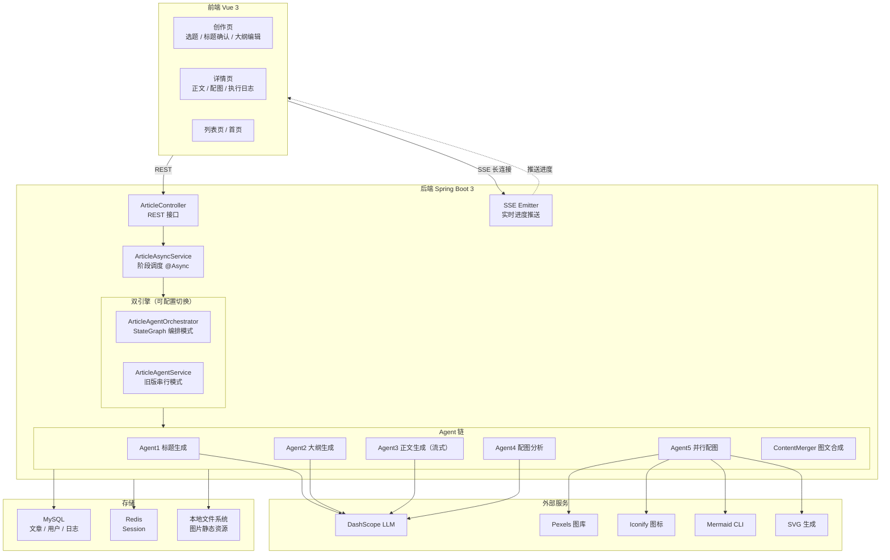

# AI-Passage-Creator

AI-Passage-Creator 是一个面向长文创作场景的 AI 应用系统。它不是单次调用模型接口的文本生成 Demo，而是把文章生产拆成标题生成、标题确认、大纲生成、大纲编辑、正文生成、配图分析、并行配图、图文合成、结果落库这一整条可控链路。

后端基于 Spring Boot 3 + Spring AI Alibaba + MyBatis-Flex，前端基于 Vue 3 + Vite + Ant Design Vue，实现了 SSE 实时反馈、人机协同编辑、多 Agent 编排切换、执行日志留痕和 Markdown 导出。

## 系统架构



## 核心能力

- 三阶段创作流程：创建任务生成标题，确认标题生成大纲，确认大纲生成正文与配图。
- 多 Agent 编排：可通过配置在 StateGraph 编排模式与旧版串行服务之间切换。
- SSE 流式反馈：前端实时接收标题、大纲、正文、配图进度和最终完成事件。
- 人机协同编辑：支持标题方案选择、自定义标题、拖拽编辑大纲、AI 修改大纲。
- 工程兜底：对 LLM 返回 JSON 做容错解析，并对不允许的配图方式做回退替换。
- 结果沉淀：文章正文、完整图文、配图信息、执行日志都可持久化并回看。

## 技术栈

### 后端

- Java 21
- Spring Boot 3.5.x
- Spring Web
- Spring AOP
- Spring Session + Redis
- MyBatis-Flex
- Spring AI Alibaba Agent Framework
- DashScope Chat Model
- Gson / Jsoup / Hutool

### 前端

- Vue 3
- Vite
- TypeScript
- Ant Design Vue
- Pinia
- SortableJS
- Marked

### 外部依赖

- MySQL
- Redis
- DashScope API
- Pexels API
- Mermaid CLI mmdc

## 真实业务链路

### 1. 创建任务

用户输入选题、文章风格和允许的配图方式后，后端创建 article 记录，并异步进入阶段 1 生成标题方案。

对应接口：

- POST /api/article/create

### 2. 标题生成与确认

系统生成 3 到 5 个标题方案并通过 SSE 推送到前端。用户可以直接选择，也可以自定义标题，并补充对文章的额外要求。

对应接口：

- POST /api/article/confirm-title

### 3. 大纲生成与人机协同编辑

标题确认后，系统生成结构化大纲。前端支持拖拽排序、增删章节与要点，也支持通过 AI 根据自然语言建议修改大纲。

对应接口：

- POST /api/article/ai-modify-outline
- POST /api/article/confirm-outline

### 4. 正文生成、配图分析与图文合成

确认大纲后，系统进入正文生成阶段。编排模式下会依次执行：

1. 正文生成
2. 配图需求分析
3. 按配图来源分组并行出图
4. 图文合成

系统当前支持多种配图方式：

- PEXELS：真实照片
- MERMAID：流程图、架构图等结构化图表
- ICONIFY：小型图标
- EMOJI_PACK：表情包风格图片
- SVG_DIAGRAM：概念示意图

### 5. 结果落库与回看

文章正文、完整图文、封面图、配图列表、执行状态、执行日志都会落库，用户可在详情页查看并导出 Markdown。

## 项目结构

```text
AI-Passage-Creator/
├─ src/main/java/                # Spring Boot 后端
│  ├─ controller/                # 文章、用户、统计接口
│  ├─ core/service/              # 异步生成服务、SSE 推送
│  ├─ agent/                     # 多 Agent 编排、各 Agent 实现、并行配图
│  ├─ aop/                       # Agent 执行日志切面
│  ├─ service/impl/              # 文章、用户、统计、日志服务实现
│  └─ config/                    # 线程池、图片源、信任库等配置
├─ src/main/resources/           # Spring 配置与静态资源
├─ passage-web/                  # Vue 3 前端
│  ├─ src/pages/article/         # 创作页、列表页、详情页
│  ├─ src/pages/admin/           # 管理端页面
│  ├─ src/api/                   # OpenAPI 生成接口
│  └─ src/utils/sse.ts           # SSE 连接封装
├─ sql/init.sql                  # MySQL 初始化脚本
├─ certs/                        # 额外证书与信任库文件
└─ doc/                          # 项目说明与对外材料
```

## Quick Start

### 1. 环境要求

- Java 21
- Maven 3.9+
- Node.js 20.19+ 或 22.12+
- MySQL 8+
- Redis 6+
- Mermaid CLI mmdc

### 2. 初始化数据库

先创建数据库：

```sql
CREATE DATABASE passage DEFAULT CHARACTER SET utf8mb4 COLLATE utf8mb4_unicode_ci;
```

再执行初始化脚本：

```bash
mysql -uroot -p passage < sql/init.sql
```

初始化脚本会创建：

- user
- article
- agent_log

### 3. 配置后端

后端主配置位于 src/main/resources/application.yaml，默认会导入 application-local.yaml。

至少需要确认以下配置：

```yaml
spring:
  datasource:
    url: jdbc:mysql://localhost:3306/passage
    username: root
    password: your_password
  data:
    redis:
      host: localhost
      port: 6379

ai:
  dashscope:
    api-key: your_dashscope_api_key

pexels:
  api-key: your_pexels_api_key
```

建议把本地敏感配置只保留在 application-local.yaml，不要在公开仓库中提交真实密钥。

### 4. 安装 Mermaid CLI

项目默认通过 mmdc 生成 Mermaid 图表，Windows 下会自动使用 mmdc.cmd。

```bash
npm install -g @mermaid-js/mermaid-cli
```

如果系统中找不到 mmdc，请先确认全局 npm 路径已加入环境变量。

### 5. 启动后端

在仓库根目录执行：

```bash
mvn spring-boot:run
```

默认地址：

- 后端服务：http://localhost:8567/api
- 接口文档：http://localhost:8567/api/doc.html

### 6. 启动前端

进入前端目录：

```bash
cd passage-web
npm install
npm run dev
```

Vite 默认会启动在本地开发端口，通常为：http://localhost:5173

### 7. 开始使用

推荐体验路径：

1. 注册账号并登录。
2. 进入创作页输入选题。
3. 选择标题方案并补充文章要求。
4. 编辑或让 AI 修改大纲。
5. 等待正文生成、配图生成和图文合成完成。
6. 在详情页查看执行日志并导出 Markdown。

## 配置说明

### 多 Agent 编排开关

```yaml
article:
  agent:
    orchestrator:
      enabled: true
```

- true：使用基于 StateGraph 的多 Agent 编排模式。
- false：回退到旧版 ArticleAgentService 流程。

### 前端接口地址

前端普通请求当前默认指向：

- http://localhost:8567/api

SSE 工具支持通过环境变量 VITE_API_BASE_URL 覆盖接口地址；如果前后端不在同一机器或端口，请同步调整前端请求配置。

## 页面截图

> 截图均来自本地真实运行，不含虚构数据。

**创作页 — 选题输入与配图来源选择**


**创作页 — 标题候选选择**


**创作页 — 大纲编辑（支持拖拽 + AI 修改）**


**创作页 — 正文与配图生成中（SSE 实时进度）**


**创作页 — 生成完成预览**


**文章详情页 — 图文内容与执行日志**


**文章列表页**


## 主要页面

- /：主页
- /create：文章创作页
- /article/list：文章列表页
- /article/:taskId：文章详情页
- /admin/userManage：管理员用户管理页
- /admin/statistics：管理员统计页

## 主要接口

- POST /api/user/register
- POST /api/user/login
- GET /api/user/get/login
- POST /api/article/create
- POST /api/article/confirm-title
- POST /api/article/confirm-outline
- POST /api/article/ai-modify-outline
- GET /api/article/progress/{taskId}
- GET /api/article/{taskId}
- GET /api/article/execution-logs/{taskId}
- GET /api/statistics/overview

## 当前实现亮点

- 标题方案和配图需求都做了结构化 JSON 容错解析，降低模型输出不稳定带来的失败率。
- 阶段 3 中的配图任务会按来源分组并行执行，避免所有图片串行生成。
- 执行日志通过 AOP 自动记录，详情页可以查看总体耗时和各 Agent 状态。
- 文章结果同时保留 content 和 fullContent，兼顾纯文本生成与图文合成后的展示。

## 已知注意事项

- application-local.yaml 应只保留本地配置，公开仓库前请移除真实密钥。
- 前端请求地址当前默认写死为本地后端地址，如需部署请补充环境变量或代理配置。
- Mermaid CLI、Pexels、DashScope、Redis、MySQL 均为启动前置依赖，缺一会影响部分功能。

## 后续可补强方向

- 增加部署说明，例如 Docker Compose 或统一本地开发脚本。
- 补充 application-local.example.yaml 和前端环境变量示例文件。
