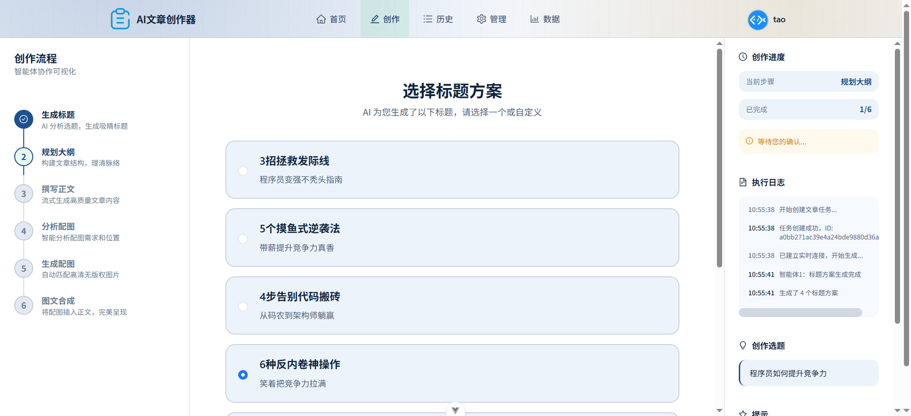
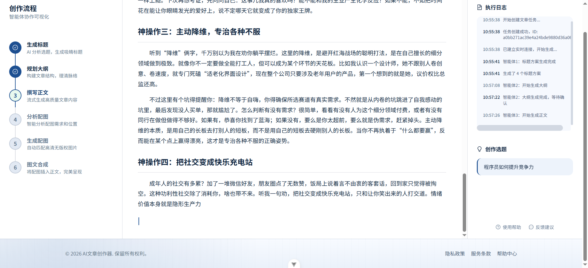
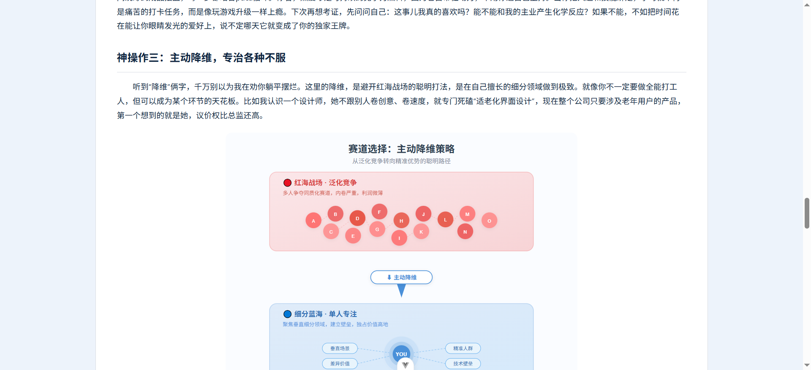

# AI-Passage-Creator

<div align="center">

**一个面向长文创作场景的人机协同 AI 内容创作平台**


[快速启动](#快速启动) • [核心架构](#核心架构) • [使用流程](#使用流程) • [技术栈](#技术栈) • [项目亮点](#项目亮点)

</div>

---

## 📖 项目简介

AI-Passage-Creator 不是单次调用模型接口的文本生成 Demo，而是一个**完整的 AI 应用系统**，把文章生产拆成：

```
选题 → 标题生成与选择 → 大纲生成与编辑 → 正文+配图并行生成 → 图文合成 → 结果落库
```

**系统特点**：
- ✅ **分阶段可控**：用户在标题、大纲阶段有确认权，避免黑盒生成
- ✅ **实时反馈**：SSE 流式推送，用户能看到完整的生成过程（进度 0-100%）
- ✅ **多 Agent 编排**：标题、大纲、正文、配图分析、配图执行、图文合成 6 个 Agent 协作
- ✅ **人机协同**：支持标题选择、大纲编辑、拖拽排序、错误重试
- ✅ **工程化**：多层容错、自动降级、SVG 缓存优化、完整日志追踪

---

## 🚀 快速启动

### 前置依赖
- **JDK 21+**（后端）
- **Node.js 18+**（前端）
- **MySQL 8.0+**（数据库）
- **Redis 6.0+**（缓存）
- **DashScope API Key**（阿里云，用于调用 GLM-4 等模型）

### 步骤 1：后端启动

```bash
# 克隆项目
git clone <repo-url>
cd AI-Passage-Creator

# 创建数据库并初始化
mysql -u root -p < sql/init.sql

# 配置本地环境变量
cp src/main/resources/application-local.example.yaml \
   src/main/resources/application-local.yaml

# 编辑 application-local.yaml，填入：
# - spring.datasource.password: MySQL 密码
# - spring.data.redis.password: Redis 密码
# - dashscope.api-key: 你的 API Key

# 编译并启动后端
mvn clean package
java -jar target/AI-Passage-Creator-1.0.0.jar --spring.profiles.active=local
```

后端启动后访问：http://localhost:8567/api

### 步骤 2：前端启动

```bash
# 安装依赖
cd passage-web
npm install

# 启动开发服务器
npm run dev
```

前端访问：http://localhost:5173

### 步骤 3：验证系统

1. 打开浏览器访问 http://localhost:5173
2. 使用默认账号登录（参考 `sql/init.sql`）
3. 点击"开始创作"，输入选题，观察 SSE 实时推送的生成过程

---

## 🏗️ 核心架构

### 系统流程图

```
用户输入选题/风格
    ↓
[Phase1] TitleGeneratorAgent 生成 3-5 个标题
    ↓ (SSE: TITLES_GENERATED)
用户选择标题
    ↓
[Phase2] OutlineGeneratorAgent 流式生成大纲
    ↓ (SSE: AGENT2_STREAMING x N, OUTLINE_GENERATED)
用户编辑大纲
    ↓
[Phase3] 三个 Agent 并行执行
    ├─ ContentGeneratorAgent: 流式生成正文（含占位符）
    ├─ ImageAnalyzerAgent: 分析配图需求
    └─ ParallelImageGenerator: 按 source 分组并行生成图片
    ↓ (SSE: AGENT3_STREAMING, AGENT4_COMPLETE, IMAGE_COMPLETE x N)
[Agent6] ContentMergerAgent 图文合成
    ↓
保存到数据库
    ↓
用户查看/下载/再创作
```

### 后端核心模块

| 模块 | 职责 | 关键文件 |
|------|------|--------|
| **Agent 编排** | 5 个 Agent + 状态管理 | `agent/ArticleAgentOrchestrator.java` |
| **SSE 推送** | 实时进度反馈 | `core/manager/SseEmitterManager.java` |
| **多源配图** | 并行生成 + 自动降级 | `agent/parallel/ParallelImageGenerator.java` |
| **业务流程** | 三阶段异步任务 | `core/service/ArticleAsyncService.java` |
| **数据持久化** | MyBatis-Flex + Redis | `mapper/ArticleMapper.java` |

### 前端核心页面

| 页面 | 功能 |
|------|------|
| `ArticleCreatePage.vue` | 创作主页面（标题选择→大纲编辑→生成监看） |
| `ArticleListPage.vue` | 文章列表（分页、筛选、删除） |
| `ArticleDetailPage.vue` | 文章详情（内容查看、重试、导出） |

---

## 📊 使用流程

### 场景 1：从零开始创作

```
1. 点击"开始创作"
2. 输入：选题="AI如何改变职场", 风格="tech感"
3. 等待标题生成（2-3秒）
4. 从 5 个标题中选择或自定义
5. 大纲生成中...（边生成边显示）
6. 编辑/调整大纲（可拖拽排序）
7. 点击"确认大纲"，启动正文+配图
8. 观看实时进度：
   - 正文生成中... (流式显示)
   - 配图分析中...
   - 生成图片 1/10, 2/10, ... (逐张推送)
9. 完成！查看最终文章
```

### 场景 2：标题不满意，快速重生

```
在"标题选择"阶段 → 点击"重新生成" → 生成新的 5 个标题
（大纲/正文/配图都不会重新生成）
```

### 场景 3：某个阶段失败了，重试

```
任何阶段失败 → 显示错误提示 + "重试生成"按钮
点击重试 → 从该阶段重新执行（不丢失前面的结果）
```

---

## 🛠️ 技术栈

### 后端
- **JDK 21**, **Spring Boot 3.5.x**
- **Spring AI Alibaba**：调用阿里云 GLM 模型
- **MyBatis-Flex**：轻量级 ORM
- **Redis**：Session + 配图缓存
- **Java Concurrent**：并行执行配图

### 前端
- **Vue 3**, **Vite**, **TypeScript**
- **Ant Design Vue**：UI 组件库
- **Pinia**：状态管理
- **EventSource**：SSE 实时推送
- **Marked**：Markdown 渲染

---

## ✨ 项目亮点

### 1️⃣ 多 Agent 编排框架
- 6 个 Agent 各司其职，输入/输出清晰
- 支持从任意阶段重新执行（断点续传）
- 易于扩展：新增 Agent 无需改 Controller

### 2️⃣ SSE 流式推送 + 并行执行
- Phase2/3 流式输出，用户实时看进度
- 配图按 source 分组并行，速度提升 40%（11s → 6s）
- 单张图完成立刻推送，不等待全部完成

### 3️⃣ 多层容错体系
- **LLM 级**：JSON 容错、规范化修复
- **需求级**：字段验证、占位符对齐
- **执行级**：自动降级、多源兜底（PICSUM 保底）

### 4️⃣ 人机协同设计
- 标题可选、大纲可编、错误可重试
- 既能加速也能精调
- 用户对生成过程有充分控制权

### 5️⃣ 完整可观测性
- AOP 自动记录每个 Agent 执行（耗时、入参、出参）
- SSE 实时反馈系统状态
- agent_log 表支持事后回查和性能分析

---

## 📚 项目文档

| 文档 | 说明 |
|------|------|
| [快速启动](./QUICKSTART.md) | 详细的启动指南和故障排查 |
| [架构设计](./doc/improve/ARCHITECTURE.md) | Agent 编排、SSE、配图策略详解 |
| [面试话术](./doc/improve/INTERVIEW.md) | 13 个高频追问及回答预案 |
| [简历项目描述](./doc/improve/RESUME.md) | 简历写法与 3 分钟项目话术 |

---

## 🤝 项目结构

```
AI-Passage-Creator/
├── src/main/java/com/ywt/passage/
│   ├── agent/                    # Agent 编排核心
│   │   ├── ArticleAgentOrchestrator.java
│   │   ├── agents/               # 6 个 Agent
│   │   ├── parallel/             # 并行配图
│   │   └── tools/                # 工具函数
│   ├── controller/               # REST 接口
│   ├── service/                  # 业务逻辑
│   ├── mapper/                   # 数据持久化
│   ├── core/                     # 核心组件
│   │   ├── manager/              # SSE 管理
│   │   └── service/              # 配图服务
│   └── ...
├── passage-web/                  # Vue 3 前端
│   ├── src/pages/
│   │   ├── article/ArticleCreatePage.vue
│   │   ├── article/ArticleListPage.vue
│   │   └── ...
│   ├── src/utils/
│   │   ├── sse.ts                # SSE 客户端
│   │   └── ...
│   └── ...
├── sql/init.sql                  # 数据库初始化
└── pom.xml / package.json        # 依赖管理
```

---

## 🔧 常见配置

### 后端配置（application-local.yaml）

```yaml
spring:
  datasource:
    url: jdbc:mysql://localhost:3306/passage
    username: root
    password: your_password
  data:
    redis:
      host: localhost
      port: 6379

dashscope:
  api-key: sk-xxxxx
  model-name: qwen-plus  # 或 gpt-4-turbo 等

article:
  image:
    enabled-sources: [PEXELS, MERMAID, ICONIFY, EMOJI_PACK, SVG_DIAGRAM]
    max-concurrent-svg: 5
    cache-ttl-hours: 24
```

### 环境变量（生产环境）

```bash
export DASHSCOPE_API_KEY="your_key"
export MYSQL_PASSWORD="your_password"
export REDIS_PASSWORD="your_password"
```

---

## 🐛 常见问题

**Q: 后端启动失败，显示"无法连接 MySQL"**
A: 检查：
1. MySQL 是否运行：`mysql -u root -p`
2. 密码是否正确填入 `application-local.yaml`
3. 数据库是否初始化：`mysql -u root -p < sql/init.sql`

**Q: SSE 连接断开，前端没有重连**
A: 浏览器会自动重连，重连间隔为 3 秒。查看浏览器控制台的 Network 标签，应该能看到自动重新发起的 SSE 请求。

**Q: 配图生成很慢**
A: 检查：
1. DALL_E 来源是否启用（如果启用，首次生成会较慢）
2. 参考后端日志查看各 Agent 的耗时
3. 可以禁用某些来源：修改 `enabledImageMethods` 参数

---


## �️ 页面截图

**创作页：选题输入、标题确认与大纲编辑**



**生成中页面：SSE 实时反馈、正文流式输出与配图进度**



**详情页：图文结果、任务状态与执行日志**



---

## 📄 许可证

MIT

