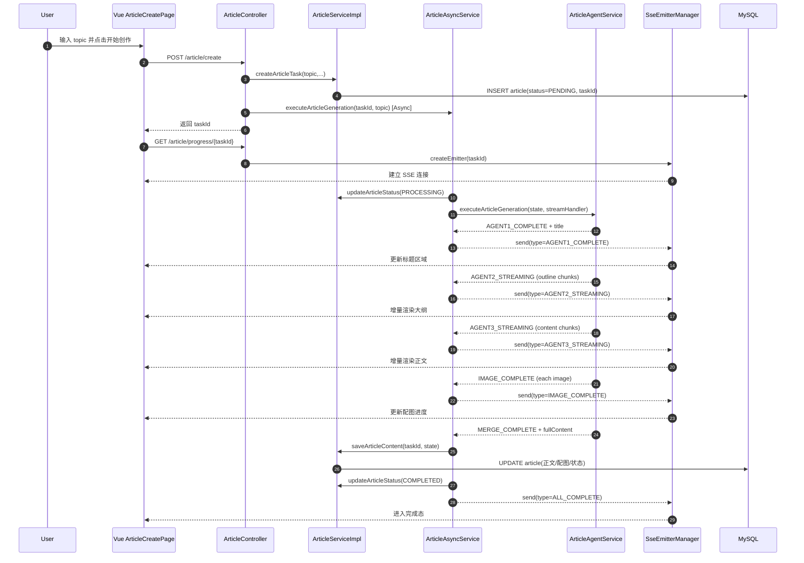

# 项目深度解读与技术落地白皮书

> 项目：AI-Passage-Creator  
> 版本基线：当前工作区代码（2026-04-15）  
> 目标：仅基于“已实现代码”进行深度解析，不包含未来规划与缺失功能设计。

---

## 1. 项目核心架构全景

### 1.1 项目定位

本项目是一个 **“AI 文章生成与管理的一体化全栈系统”**：

- 后端：基于 Spring Boot 的任务编排服务，负责用户会话鉴权、文章任务生命周期、LLM 调用、图片检索与 SSE 推送。
- 前端：基于 Vue 3 的交互界面，负责登录注册、文章创作、流式渲染、历史管理与导出。

从代码形态看，它不是单纯的 CRUD 后台，而是一个 **“异步任务 + 流式状态回传 + 富文本产物落库”** 的业务系统。

---

### 1.2 技术栈深度清单（含职责）

#### 后端

- **Java 21**（`pom.xml`）
  - 运行语言基础。
- **Spring Boot 3.5.10**（`pom.xml`）
  - Web 容器、IOC、配置加载、自动装配。
- **MyBatis-Flex 1.11.1**（`pom.xml`）
  - Mapper + ServiceImpl 的 ORM 与分页查询能力。
- **MySQL 驱动**（`pom.xml`）
  - 文章与用户持久化。
- **Spring Data Redis + Spring Session Redis**（`pom.xml`、`application.yaml`）
  - 登录态 session 存储与跨请求维持。
- **Spring AOP**（`pom.xml`）
  - `@AuthCheck` + `AuthInterceptor` 实现方法级权限控制。
- **Spring AI Alibaba（DashScope）**（`pom.xml`）
  - LLM 调用（普通与流式）用于标题、大纲、正文、配图需求生成。
- **Gson**（`pom.xml`）
  - JSON 序列化/反序列化与 LLM 输出解析。
- **Knife4j + SpringDoc OpenAPI3**（`pom.xml`、`application.yaml`）
  - API 文档能力，支持前端 SDK 自动生成。

#### 前端

- **Vue 3.5.x**（`passage-web/package.json`）
  - 组件化页面与响应式状态。
- **Vite 8**（`passage-web/vite.config.ts`）
  - 前端开发服务器与打包。
- **TypeScript 6 + vue-tsc**（`passage-web/package.json`）
  - 类型检查与工程约束。
- **Pinia**（`passage-web/src/main.ts`、`passage-web/src/stores/loginUser.ts`）
  - 全局登录态管理。
- **Vue Router**（`passage-web/src/router/index.ts`）
  - 路由与页面装配。
- **Axios**（`passage-web/src/request.ts`）
  - 统一请求基地址、Cookie、401 处理。
- **EventSource / SSE**（`passage-web/src/utils/sse.ts`）
  - 接收后端流式状态与增量内容。
- **Ant Design Vue**（`passage-web/src/main.ts`）
  - UI 组件体系。
- **marked**（`passage-web/src/pages/article/ArticleCreatePage.vue` 等）
  - Markdown 转 HTML 展示。

---

### 1.3 目录结构拓扑与职责注解

```text
AI-Passage-Creator/
├─ pom.xml
├─ sql/
│  └─ init.sql
├─ src/main/resources/
│  ├─ application.yaml
│  └─ application-local.yaml
├─ src/main/java/com/ywt/passage/
│  ├─ AiPassageCreatorApplication.java
│  ├─ controller/
│  │  ├─ UserController.java
│  │  └─ ArticleController.java
│  ├─ service/
│  │  ├─ UserService.java
│  │  ├─ ArticleService.java
│  │  └─ impl/
│  │     ├─ UserServiceImpl.java
│  │     └─ ArticleServiceImpl.java
│  ├─ core/
│  │  ├─ service/
│  │  │  ├─ ArticleAsyncService.java
│  │  │  └─ ArticleAgentService.java
│  │  ├─ manager/
│  │  │  └─ SseEmitterManager.java
│  │  └─ ImageSearch/
│  │     └─ PexelsService.java
│  ├─ entity/
│  │  ├─ User.java
│  │  └─ Article.java
│  ├─ model/
│  │  ├─ dto/
│  │  ├─ vo/
│  │  └─ enums/
│  ├─ annotation/
│  │  └─ AuthCheck.java
│  ├─ aspect/
│  │  └─ AuthInterceptor.java
│  ├─ common/
│  ├─ exception/
│  ├─ mapper/
│  └─ constant/
└─ passage-web/
   ├─ package.json
   ├─ vite.config.ts
   ├─ openapi2ts.config.ts
   └─ src/
      ├─ main.ts
      ├─ App.vue
      ├─ access.ts
      ├─ request.ts
      ├─ router/
      ├─ api/
      ├─ stores/
      ├─ utils/
      ├─ layouts/
      ├─ components/
      └─ pages/
```

协作关系：

1. `controller` 为入站适配层，做参数校验、权限入口与响应包装。
2. `service/impl` 为业务规则层，处理会话验证、数据权限、查询与持久化。
3. `core/service` 为任务编排层，完成 AI 多阶段工作流与流式消息输出。
4. `core/manager/SseEmitterManager` 为连接管理层，维护 SSE 生命周期。
5. `entity + mapper` 为数据访问层，映射 `user`、`article` 两张核心表。
6. 前端 `pages` 呈现业务，`api` 访问后端，`stores` 存全局登录态，`utils/sse.ts` 处理实时数据。

---

## 2. 核心业务逻辑与代码级解读（重中之重）

### 2.1 程序启动与初始化

### 后端启动

入口文件：`src/main/java/com/ywt/passage/AiPassageCreatorApplication.java`

```java
@SpringBootApplication
@EnableAspectJAutoProxy(exposeProxy = true)
public class AiPassageCreatorApplication {
    public static void main(String[] args) {
        SpringApplication.run(AiPassageCreatorApplication.class, args);
        System.out.println("Service Start Successful ~~");
    }
}
```

启动时发生的关键动作：

1. 通过 `@SpringBootApplication` 启动组件扫描，加载所有 `@Service/@Component/@Configuration`。
2. 通过 `@EnableAspectJAutoProxy` 启用 AOP，使 `@AuthCheck` 能被切面拦截。
3. 加载 `application.yaml`，并通过 `spring.config.import` 合并 `application-local.yaml`。
4. 初始化 Web、Redis Session、MyBatis-Flex、DashScope ChatModel 等基础 Bean。

### 前端启动

入口文件：`passage-web/src/main.ts`

```ts
const app = createApp(App);

app.use(createPinia());
app.use(router);
app.use(Antd);
app.provide("locale", zhCN);
app.mount("#app");
```

启动顺序说明：

1. 创建根应用 `createApp(App)`。
2. 注入 Pinia（全局状态）。
3. 注入 Router（页面路由系统）。
4. 注入 Ant Design Vue（UI 组件系统）。
5. 在应用启动时导入 `access.ts`，注册全局权限守卫。

### 路由与权限注册

文件：`passage-web/src/access.ts`

核心逻辑：

- 通过 `startFetchLoginUser()` 预取当前登录用户，避免重复请求。
- 对 `/admin` 路由做阻塞式鉴权（必须先拿到登录态）。
- 对普通页面做非阻塞预取（提升首屏体验）。
- 非管理员访问后台路由时跳转登录页并附带 redirect 参数。

---

### 2.2 关键功能模块剖析

## 模块 A：用户认证与权限模块

#### 核心文件路径

- `src/main/java/com/ywt/passage/controller/UserController.java`
- `src/main/java/com/ywt/passage/service/impl/UserServiceImpl.java`
- `src/main/java/com/ywt/passage/aspect/AuthInterceptor.java`
- `passage-web/src/stores/loginUser.ts`
- `passage-web/src/request.ts`

#### 核心函数/类

1. `UserServiceImpl.userRegister(userAccount, userPassword, checkPassword)`
   - 输入：账号/密码/确认密码
   - 输出：新用户 ID
   - 逻辑：参数校验 -> 账号查重 -> 密码 MD5+盐 -> 保存用户

2. `UserServiceImpl.userLogin(userAccount, userPassword, request)`
   - 输入：账号/密码/HttpServletRequest
   - 输出：`LoginUserVO`
   - 逻辑：账号密码查询 -> session 写入 `USER_LOGIN_STATE` -> 返回脱敏 VO

3. `UserServiceImpl.getLoginUser(request)`
   - 输入：请求
   - 输出：当前登录用户实体
   - 逻辑：从 session 取用户 -> 用 ID 回表拿最新数据 -> 未登录抛异常

4. `AuthInterceptor.doInterceptor(...)`
   - 输入：方法注解 `mustRole`
   - 输出：通过或抛 `NO_AUTH_ERROR`
   - 逻辑：读取登录用户角色 -> 对比注解要求角色 -> 拦截或放行

#### 代码逻辑流

登录流程：

1. 前端登录页提交 `userLogin`。
2. 后端校验账号密码后写入 session。
3. 前端全局 store 拉取 `/user/get/login` 更新登录态。
4. 路由守卫根据角色决定后台路由放行或拦截。
5. Axios 响应拦截器对 `40100` 统一重定向登录。

#### 关键代码片段

```java
// UserServiceImpl.java
request.getSession().setAttribute(USER_LOGIN_STATE, user);
```

```java
// AuthInterceptor.java
@Around("@annotation(authCheck)")
public Object doInterceptor(ProceedingJoinPoint joinPoint, AuthCheck authCheck) throws Throwable {
    String mustRole = authCheck.mustRole();
    User loginUser = userService.getLoginUser(request);
    ...
    return joinPoint.proceed();
}
```

```ts
// request.ts
if (data.code === 40100) {
  window.location.href = `/user/login?redirect=${encodeURIComponent(redirectPath)}`;
}
```

---

## 模块 B：文章任务生命周期与持久化模块

#### 核心文件路径

- `src/main/java/com/ywt/passage/controller/ArticleController.java`
- `src/main/java/com/ywt/passage/service/impl/ArticleServiceImpl.java`
- `src/main/java/com/ywt/passage/entity/Article.java`
- `src/main/java/com/ywt/passage/model/vo/ArticleVO.java`

#### 核心函数/类

1. `ArticleController.createArticle(...)`
   - 输入：`ArticleCreateRequest`
   - 输出：`taskId`
   - 逻辑：参数校验 -> 获取登录用户 -> 创建任务记录 -> 异步启动生成

2. `ArticleServiceImpl.createArticleTask(topic, style, enabledImageMethods, loginUser)`
   - 输入：选题等参数 + 用户
   - 输出：任务 ID
   - 逻辑：生成 UUID -> 写入 article 表（`PENDING`）

3. `ArticleServiceImpl.saveArticleContent(taskId, state)`
   - 输入：任务 ID + `ArticleState`
   - 输出：无
   - 逻辑：将 state 中标题、大纲、正文、图片、fullContent 映射并更新数据库

4. `ArticleServiceImpl.listArticleByPage(request, loginUser)`
   - 输入：分页条件 + 当前用户
   - 输出：`Page<ArticleVO>`
   - 逻辑：管理员可查全量，普通用户仅查本人数据

#### 代码逻辑流

1. 创建任务即落库，先有 taskId 再做异步生成。
2. 状态流转为 `PENDING -> PROCESSING -> COMPLETED/FAILED`。
3. 全部内容生成完成后统一落库，形成可追溯历史记录。
4. 对外返回 `ArticleVO`，由 `objToVo` 把 JSON 字段反解成结构化列表。

#### 关键代码片段

```java
// ArticleServiceImpl.java
article.setTaskId(taskId);
article.setStatus(ArticleStatusEnum.PENDING.getValue());
this.save(article);
```

```java
article.setOutline(GsonUtils.toJson(state.getOutline().getSections()));
article.setImages(GsonUtils.toJson(state.getImages()));
article.setFullContent(state.getFullContent());
this.updateById(article);
```

```java
// 普通用户仅可访问自己的文章
if (!article.getUserId().equals(loginUser.getId()) && !ADMIN_ROLE.equals(loginUser.getUserRole())) {
    throw new BusinessException(ErrorCode.NO_AUTH_ERROR);
}
```

---

## 模块 C：AI 编排 + SSE 流式回传模块（系统核心）

#### 核心文件路径

- `src/main/java/com/ywt/passage/core/service/ArticleAsyncService.java`
- `src/main/java/com/ywt/passage/core/service/ArticleAgentService.java`
- `src/main/java/com/ywt/passage/core/manager/SseEmitterManager.java`
- `passage-web/src/utils/sse.ts`
- `passage-web/src/pages/article/ArticleCreatePage.vue`

#### 核心函数/类

1. `ArticleAsyncService.executeArticleGeneration(taskId, topic)`
   - `@Async("articleExecutor")` 在线程池执行。
   - 负责状态更新、调用 Agent 编排、保存结果、发送完成/错误消息。

2. `ArticleAgentService.executeArticleGeneration(state, streamHandler)`
   - 按顺序执行 5 个智能体阶段：
     - Agent1：标题
     - Agent2：大纲（流式）
     - Agent3：正文（流式）
     - Agent4：配图需求
     - Agent5：配图检索
     - merge：图文合并

3. `SseEmitterManager`
   - 维护 `taskId -> SseEmitter` 映射。
   - 处理创建、发送、完成、异常回收。

4. 前端 `handleSSEMessage`
   - 按 `msg.type` 更新步骤条、内容区、图片进度与完成状态。

#### 代码逻辑流

1. 前端创建任务后拿到 taskId。
2. 前端建立 `EventSource(/article/progress/{taskId})`。
3. 后端异步执行 AI 流程，边执行边发消息。
4. 前端实时增量渲染大纲/正文。
5. 完成后后端发送 `ALL_COMPLETE`，前端将页面切换为完成态。

#### 关键代码片段

```java
// ArticleAsyncService.java
articleService.updateArticleStatus(taskId, ArticleStatusEnum.PROCESSING, null);
articleAgentService.executeArticleGeneration(state, message -> handleAgentMessage(taskId, message, state));
articleService.saveArticleContent(taskId, state);
articleService.updateArticleStatus(taskId, ArticleStatusEnum.COMPLETED, null);
sendSseMessage(taskId, SseMessageTypeEnum.ALL_COMPLETE, Map.of("taskId", taskId));
```

```java
// ArticleAgentService.java
Flux<ChatResponse> streamResponse = chatModel.stream(new Prompt(new UserMessage(prompt)));
streamResponse.doOnNext(response -> {
    String chunk = response.getResult().getOutput().getText();
    contentBuilder.append(chunk);
    streamHandler.accept(messageType.getStreamingPrefix() + chunk);
}).blockLast();
```

```ts
// sse.ts
eventSource.onmessage = (event) => {
  const message: SSEMessage = JSON.parse(event.data);
  onMessage(message);
  if (message.type === "ALL_COMPLETE" || message.type === "ERROR") {
    eventSource.close();
    onComplete?.();
  }
};
```

---

## 3. 数据流与持久化分析

### 3.1 数据模型（Schema/Interface）

### 实体：User

来源：`src/main/java/com/ywt/passage/entity/User.java`

关键字段：

- `id`: 雪花算法主键
- `userAccount`: 登录账号（唯一）
- `userPassword`: 密码哈希值
- `userName/userAvatar/userProfile`: 展示信息
- `userRole`: `user/admin`
- `isDelete`: 逻辑删除

### 实体：Article

来源：`src/main/java/com/ywt/passage/entity/Article.java`、`sql/init.sql`

关键字段：

- `id`: 自增主键
- `taskId`: UUID 任务标识（唯一）
- `userId`: 所属用户
- `topic`: 输入选题
- `mainTitle/subTitle`: 标题
- `outline`: JSON 大纲
- `content`: 正文（Markdown）
- `fullContent`: 含图正文（Markdown）
- `coverImage`: 封面 URL
- `images`: JSON 图片列表
- `status`: PENDING/PROCESSING/COMPLETED/FAILED
- `errorMessage`: 失败原因
- `createTime/completedTime/updateTime`
- `isDelete`: 逻辑删除

### 状态对象：ArticleState

来源：`src/main/java/com/ywt/passage/model/dto/article/ArticleState.java`

作用：

- 作为 AI 编排过程中的内存态“上下文容器”。
- 串联标题、大纲、正文、配图需求、配图结果、最终合成文本。

### 对外对象：ArticleVO

来源：`src/main/java/com/ywt/passage/model/vo/ArticleVO.java`

作用：

- 面向前端输出。
- `objToVo` 中将 `outline/images` 的 JSON 字符串反序列化为结构化数组。

---

### 3.2 数据流转路径（输入 -> 处理 -> 存储）

### 链路 A：登录

1. 用户提交 `UserLoginRequest`（前端登录页）。
2. `/user/login` -> `UserServiceImpl.userLogin`。
3. 账号密码校验后写入 session。
4. 前端通过 `/user/get/login` 更新全局 store。

### 链路 B：文章创作（核心）

1. 用户输入选题（`topic`）并点击开始。
2. 前端调用 `/article/create`，后端创建任务记录。
3. 异步服务切换状态为 PROCESSING。
4. Agent 链路生成标题、大纲、正文、配图需求、图片并合成。
5. 每个阶段通过 SSE 推送状态与增量内容。
6. 最终落库为 article 完整记录并标记 COMPLETED。
7. 前端历史页通过 `/article/list` 查询，详情页通过 `/article/{taskId}` 展示。

### API 定义位置与调用方式

- 后端定义：`controller` 包。
- 前端调用：`passage-web/src/api/*.ts`（由 `openapi2ts` 生成）
- 统一请求封装：`passage-web/src/request.ts`
- SSE 通道：`passage-web/src/utils/sse.ts`

---

## 4. 详细运行流程（可视化）

以下为“文章创作主链路”时序图（Mermaid）：



---

## 5. 配置与环境落地指南

### 5.1 环境变量与配置解析

### 后端配置文件

- `src/main/resources/application.yaml`
  - `spring.config.import`: 引入本地私有配置
  - `spring.datasource`: MySQL 连接
  - `spring.session.store-type=redis`: session 存储介质
  - `spring.data.redis`: Redis 连接
  - `server.port=8567` + `context-path=/api`: 服务入口
  - `springdoc/knife4j`: API 文档
  - `pexels.api-key`: 图片检索密钥占位

- `src/main/resources/application-local.yaml`
  - 本地私密 API Key（DashScope、Pexels）
  - 已被 `.gitignore` 排除

### 前端配置点

- `passage-web/src/request.ts`
  - `baseURL = http://localhost:8567/api`
  - `withCredentials = true`（必须携带 session cookie）
- `passage-web/src/utils/sse.ts`
  - 默认使用 `VITE_API_BASE_URL` 或回退到 `http://localhost:8567/api`

---

### 5.2 依赖与构建

### 后端（Maven）

```bash
mvn clean package
```

逻辑说明：

1. 下载并解析依赖。
2. 编译 Java 源码。
3. 执行测试（当前测试仅 contextLoads）。
4. 生成可运行 jar（由 spring-boot-maven-plugin 负责）。

### 前端（npm）

```bash
cd passage-web
npm install
npm run build
```

`npm run build` 的实际组成：

- `type-check`: `vue-tsc --build`
- `build-only`: `vite build`

可选：

- `npm run dev`: 本地开发（默认 4399）
- `npm run openapi2ts`: 根据后端 OpenAPI 文档生成 API SDK

---

### 5.3 从零启动步骤（可直接执行）

1. 准备依赖环境：JDK 21、Maven、Node.js 20+、MySQL、Redis。
2. 执行数据库初始化：导入 `sql/init.sql`。
3. 检查后端配置：`application.yaml` 与 `application-local.yaml`。
4. 启动后端：

```bash
mvn spring-boot:run
```

5. 启动前端：

```bash
cd passage-web
npm install
npm run dev
```

6. 访问前端（默认 `http://localhost:4399`），进行注册/登录/创作/查看。

---

## 6. API 逐接口深度附录

> 以下接口均返回统一结构：
>
> ```json
> { "code": 0, "data": ..., "message": "ok" }
> ```

### 6.1 用户接口（`/api/user`）

### POST `/user/register`

- 入参：`UserRegisterRequest`
  - `userAccount`, `userPassword`, `checkPassword`
- 主流程：参数校验 -> 账号查重 -> 密码加盐 MD5 -> 写入 `user`
- 返回：新用户 ID（Long）

### POST `/user/login`

- 入参：`UserLoginRequest`
  - `userAccount`, `userPassword`
- 主流程：账号密码匹配 -> session 写登录态
- 返回：`LoginUserVO`

### GET `/user/get/login`

- 入参：无
- 主流程：从 session 读取并回表验证用户
- 返回：`LoginUserVO`

### POST `/user/logout`

- 入参：无
- 主流程：移除 session 登录态
- 返回：Boolean

### POST `/user/add`（管理员）

- 注解：`@AuthCheck(mustRole = "admin")`
- 入参：`UserAddRequest`
- 主流程：复用注册流程 -> 更新扩展信息与角色
- 返回：新用户 ID

### POST `/user/delete`（管理员）

- 注解：`@AuthCheck(mustRole = "admin")`
- 入参：`DeleteRequest{id}`
- 主流程：按 ID 删除用户（逻辑删除）
- 返回：Boolean

---

### 6.2 文章接口（`/api/article`）

### POST `/article/create`

- 入参：`ArticleCreateRequest`
  - 当前主流程实际使用：`topic`
- 主流程：
  1. 校验选题
  2. 获取登录用户
  3. 创建任务记录（PENDING）
  4. 异步执行生成
- 返回：`taskId`

### GET `/article/progress/{taskId}`

- 入参：路径参数 `taskId`
- 主流程：
  1. 校验登录与任务权限
  2. 创建 SSE Emitter
  3. 等待异步任务推送
- 返回：SSE 流

### GET `/article/{taskId}`

- 注解：`@AuthCheck(mustRole = "user")`
- 主流程：按 taskId 查询 + 数据权限校验
- 返回：`ArticleVO`

### POST `/article/list`

- 注解：`@AuthCheck(mustRole = "user")`
- 入参：`ArticleQueryRequest`
- 主流程：分页查询 + 按用户角色过滤 + 状态筛选
- 返回：`Page<ArticleVO>`

### POST `/article/delete`

- 注解：`@AuthCheck(mustRole = "user")`
- 入参：`DeleteRequest{id}`
- 主流程：删除前校验文章归属权限
- 返回：Boolean

---

### 6.3 SSE 消息契约（前后端约定）

来源：`SseMessageTypeEnum` + 前端 `handleSSEMessage`

- `AGENT1_COMPLETE`：标题完成，携带 `title`
- `AGENT2_STREAMING`：大纲增量片段，携带 `content`
- `AGENT2_COMPLETE`：大纲完成
- `AGENT3_STREAMING`：正文增量片段，携带 `content`
- `AGENT3_COMPLETE`：正文完成
- `AGENT4_COMPLETE`：配图需求完成，携带 `imageRequirements`
- `IMAGE_COMPLETE`：单图完成，携带 `image`
- `AGENT5_COMPLETE`：全部配图完成，携带 `images`
- `MERGE_COMPLETE`：图文合并完成，携带 `fullContent`
- `ALL_COMPLETE`：全流程完成
- `ERROR`：失败，携带 `message`

---

## 结语

本项目当前实现呈现出清晰的“分层 + 编排 + 流式回传”架构：

- 分层明确：Controller 薄、Service 承载业务、Core 承载编排；
- 状态闭环：任务状态可追踪，异常可回写；
- 体验导向：SSE 让用户可见生成过程而非黑盒等待；
- 数据可运营：文章产物完整持久化并可复查导出。

这使其具备从 Demo 走向稳定业务系统的良好工程基础。
