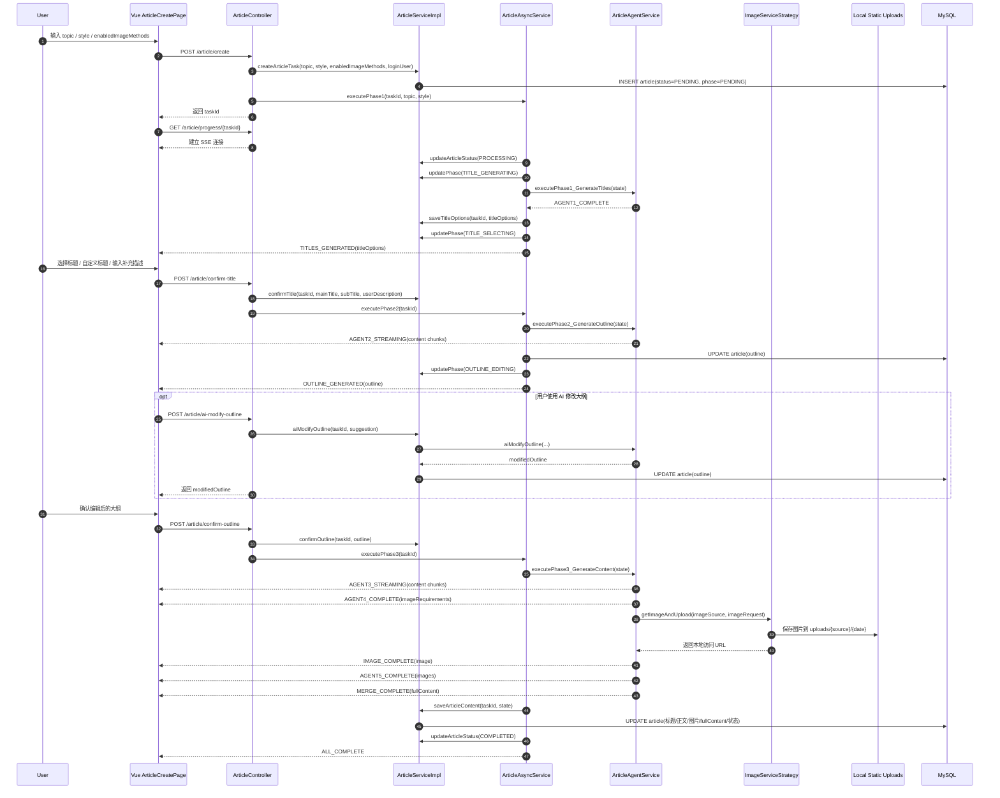

# 项目深度解读与技术落地白皮书

> 项目：AI-Passage-Creator  
> 版本基线：当前工作区代码（2026-04-21）  
> 目标：仅基于“已实现代码”进行深度解析，不包含未来规划与缺失功能设计。

---

## 1. 项目核心架构全景

### 1.1 项目定位

本项目当前已经从“单次提交、一次性生成”的 AI 写作 Demo，演进为一个 **“多 Agent 协同创作 + 分阶段交互式确认 + 异步任务编排 + SSE 实时回传 + 多源配图 + 本地静态资源落盘”** 的全栈系统。

它的核心价值不只是生成文章，而是把整条创作链路拆成了可观察、可干预、可追踪的业务流程：

- 用户先输入选题、文章风格、允许的配图方式；
- 后端先异步生成多个标题方案；
- 用户确认标题并补充描述后，再生成大纲；
- 用户可以手动编辑大纲，也可以调用 AI 再次改写大纲；
- 最后才进入正文生成、配图分析、配图执行、图文合成与持久化。

因此，这已经不是传统意义上的 CRUD 管理后台，而是一个 **“多 Agent 驱动、状态机控制的人机协作创作系统”**。

---

### 1.2 技术栈深度清单（含职责）

#### 后端

- **Java 21**（`pom.xml`）
  - 运行时语言基础。
- **Spring Boot 3.5.10**（`pom.xml`）
  - Web 容器、IOC、配置装配、应用启动入口。
- **MyBatis-Flex 1.11.1**（`pom.xml`）
  - ORM、分页、查询构造与 ServiceImpl 基础能力。
- **MySQL Driver**（`pom.xml`）
  - 用户与文章数据持久化。
- **Spring Data Redis + Spring Session Redis**（`pom.xml`、`application.yaml`）
  - Session 登录态存储与跨请求共享。
- **Spring AOP**（`pom.xml`）
  - `@AuthCheck` 管理方法级权限校验。
- **Spring AI Alibaba Agent Framework + DashScope Starter**（`pom.xml`）
  - 提供大模型调用、流式响应与 Agent 编排基础。
- **Gson**（`pom.xml`）
  - LLM 返回 JSON、文章大纲、标题方案、配图数据的序列化与反序列化。
- **Java HttpClient**（`LocalImageStorageService.java`）
  - 下载远程图片并统一转存到本地静态目录。
- **Jsoup**（`pom.xml`、`EmojiPackService.java`）
  - 表情包图片抓取与 HTML 解析。
- **Mermaid CLI**（`MermaidService.java`、`application.yaml`）
  - 根据大模型生成的 Mermaid 代码产出 SVG 图示。
- **Knife4j + SpringDoc OpenAPI3**（`pom.xml`、`application.yaml`）
  - API 文档展示与前端 SDK 生成支撑。

#### 前端

- **Vue 3.5.x**（`passage-web/package.json`）
  - 页面与组件的响应式交互框架。
- **Vite 8**（`passage-web/vite.config.ts`）
  - 开发服务器与构建工具。
- **TypeScript 6 + vue-tsc**（`passage-web/package.json`）
  - 类型约束与编译期检查。
- **Pinia**（`passage-web/src/stores/loginUser.ts`）
  - 全局登录态与用户信息管理。
- **Vue Router**（`passage-web/src/router/index.ts`）
  - 页面路由与导航守卫。
- **Axios**（`passage-web/src/request.ts`）
  - 统一请求封装、Cookie 透传与未登录拦截。
- **EventSource / SSE**（`passage-web/src/utils/sse.ts`）
  - 消费后端流式消息并驱动页面阶段切换。
- **Ant Design Vue**（`passage-web/src/main.ts`）
  - 基础 UI 组件体系。
- **marked**（`passage-web/src/pages/article/ArticleCreatePage.vue`、`ArticleDetailPage.vue`）
  - Markdown 转 HTML 展示。
- **sortablejs**（`passage-web/package.json`、`OutlineEditingStage.vue`）
  - 大纲编辑阶段的拖拽排序能力。

---

### 1.3 目录结构拓扑与职责注解

```text
AI-Passage-Creator/
├─ pom.xml
├─ certs/
│  └─ dashscope-truststore.jks
├─ sql/
│  └─ init.sql
├─ src/main/resources/
│  ├─ application.yaml
│  ├─ application-local.yaml
│  └─ static/uploads/
├─ src/main/java/com/ywt/passage/
│  ├─ AiPassageCreatorApplication.java
│  ├─ controller/
│  │  ├─ UserController.java
│  │  └─ ArticleController.java
│  ├─ config/
│  │  ├─ AsyncConfig.java
│  │  ├─ LocalUploadResourceConfig.java
│  │  ├─ ExtraTrustStoreInitializer.java
│  │  ├─ MermaidConfig.java
│  │  ├─ IconifyConfig.java
│  │  ├─ PexelsConfig.java
│  │  ├─ SvgDiagramConfig.java
│  │  └─ EmojiPackConfig.java
│  ├─ core/
│  │  ├─ manager/
│  │  │  └─ SseEmitterManager.java
│  │  ├─ service/
│  │  │  ├─ ArticleAsyncService.java
│  │  │  └─ ArticleAgentService.java
│  │  └─ ImageSearch/
│  │     ├─ PexelsService.java
│  │     ├─ MermaidService.java
│  │     ├─ IconifyService.java
│  │     ├─ EmojiPackService.java
│  │     └─ SvgDiagramService.java
│  ├─ service/
│  │  ├─ ArticleService.java
│  │  ├─ UserService.java
│  │  ├─ ImageServiceStrategy.java
│  │  ├─ LocalImageStorageService.java
│  │  └─ impl/
│  │     ├─ ArticleServiceImpl.java
│  │     └─ UserServiceImpl.java
│  ├─ entity/
│  │  ├─ User.java
│  │  └─ Article.java
│  ├─ model/
│  │  ├─ dto/
│  │  ├─ enums/
│  │  └─ vo/
│  ├─ annotation/
│  ├─ aspect/
│  ├─ mapper/
│  ├─ constant/
│  └─ utils/
└─ passage-web/
   ├─ package.json
   ├─ openapi2ts.config.ts
   └─ src/
      ├─ main.ts
      ├─ access.ts
      ├─ request.ts
      ├─ router/
      ├─ api/
      ├─ stores/
      ├─ utils/
      ├─ layouts/
      ├─ components/
      └─ pages/
         ├─ admin/
         ├─ article/
         │  ├─ ArticleCreatePage.vue
         │  ├─ ArticleDetailPage.vue
         │  ├─ ArticleListPage.vue
         │  └─ components/
         │     ├─ TitleSelectingStage.vue
         │     └─ OutlineEditingStage.vue
         └─ user/
```

当前职责分层如下：

1. `controller` 是入站 API 层，负责参数校验、权限入口、响应包装。
2. `service/impl` 是业务规则层，负责文章归属校验、阶段校验、状态变更与数据持久化。
3. `core/service` 是任务编排层，负责三阶段异步执行和多 Agent 编排。
4. `service/ImageServiceStrategy` 与 `LocalImageStorageService` 组成图片治理层，统一做来源选择、下载、存储与降级。
5. `config` 承载线程池、静态资源映射、图片来源配置与额外信任库初始化。
6. 前端 `pages/article` 负责创作、编辑、历史、详情等用户交互闭环。

---

## 2. 核心业务逻辑与代码级解读

### 2.1 程序启动与初始化

### 后端启动

入口文件：`src/main/java/com/ywt/passage/AiPassageCreatorApplication.java`

```java
@SpringBootApplication
@EnableAspectJAutoProxy(exposeProxy = true)
public class AiPassageCreatorApplication {

    public static void main(String[] args) {
        SpringApplication application = new SpringApplication(AiPassageCreatorApplication.class);
        application.addInitializers(new ExtraTrustStoreInitializer());
        application.run(args);
        System.out.println("Service Start Successful ~~");
    }
}
```

启动时发生的关键动作：

1. `@SpringBootApplication` 触发组件扫描，装配 Controller、Service、Config、Mapper 等 Bean。
2. `@EnableAspectJAutoProxy` 让 `@AuthCheck` 对控制器方法和服务逻辑生效。
3. `ExtraTrustStoreInitializer` 在 Spring 容器刷新前加载额外 truststore，修复企业代理或自定义证书链环境中的 HTTPS 调用问题。
4. `application.yaml` 通过 `spring.config.import` 合并 `application-local.yaml`，把本地密钥与基础配置分离。
5. `AsyncConfig` 注册 `articleExecutor` 线程池，使阶段任务能异步执行。
6. `LocalUploadResourceConfig` 把本地上传目录映射到 `/uploads/**`，让图片落盘后可直接访问。

### 前端启动

入口文件：`passage-web/src/main.ts`

```ts
const app = createApp(App)

app.use(createPinia())
app.use(router)
app.use(Antd)
app.provide('locale', zhCN)
app.mount('#app')
```

启动顺序说明：

1. 创建根应用并挂载 `App.vue`。
2. 注入 Pinia 以持有登录用户状态。
3. 注入 Router 负责页面切换。
4. 注入 Ant Design Vue 组件体系。
5. 通过 `access.ts` 注册全局守卫，按路由类型决定是否阻塞式拉取登录态。

### 路由与权限注册

文件：`passage-web/src/access.ts`

当前守卫的特点：

- `startFetchLoginUser()` 会做一次 Promise 级别复用，避免普通页面重复请求登录态。
- 访问 `/admin` 时先阻塞拿到登录用户，再做管理员校验。
- 普通页面则异步预取登录态，不阻塞首屏渲染。
- 非管理员访问后台路由会跳转登录页并附带 `redirect` 参数。

---

### 2.2 关键功能模块剖析

## 模块 A：用户认证与权限模块

#### 核心文件路径

- `src/main/java/com/ywt/passage/controller/UserController.java`
- `src/main/java/com/ywt/passage/service/impl/UserServiceImpl.java`
- `src/main/java/com/ywt/passage/aspect/AuthInterceptor.java`
- `passage-web/src/stores/loginUser.ts`
- `passage-web/src/request.ts`

#### 核心函数/类

1. `UserServiceImpl.userRegister(userAccount, userPassword, checkPassword)`
   - 输入：账号、密码、确认密码
   - 输出：新用户 ID
   - 逻辑：参数校验 -> 账号查重 -> 密码加盐哈希 -> 写入用户表

2. `UserServiceImpl.userLogin(userAccount, userPassword, request)`
   - 输入：账号、密码、请求对象
   - 输出：`LoginUserVO`
   - 逻辑：账号密码匹配 -> Session 写入 `USER_LOGIN_STATE` -> 返回脱敏视图

3. `AuthInterceptor.doInterceptor(...)`
   - 输入：`@AuthCheck` 注解
   - 输出：放行或抛异常
   - 逻辑：读取登录用户 -> 对比要求角色 -> 拦截或放行

4. `UserController.listUserByPage(...)`、`updateUser(...)`、`deleteUser(...)`
   - 作用：为管理员用户管理页提供分页查询、编辑和删除能力

#### 代码逻辑流

1. 登录页提交 `/user/login`。
2. 后端校验后把用户写入 Redis Session。
3. 前端全局 Store 拉取 `/user/get/login` 更新当前用户。
4. 路由守卫根据用户角色决定后台页是否放行。
5. Axios 响应拦截器在 `40100` 时统一重定向登录。

#### 关键代码片段

```java
request.getSession().setAttribute(USER_LOGIN_STATE, user);
```

```java
@Around("@annotation(authCheck)")
public Object doInterceptor(ProceedingJoinPoint joinPoint, AuthCheck authCheck) throws Throwable {
    String mustRole = authCheck.mustRole();
    User loginUser = userService.getLoginUser(request);
    ...
    return joinPoint.proceed();
}
```

```ts
if (data.code === 40100) {
  window.location.href = `/user/login?redirect=${encodeURIComponent(redirectPath)}`
}
```

---

## 模块 B：文章任务生命周期与阶段状态模块

#### 核心文件路径

- `src/main/java/com/ywt/passage/controller/ArticleController.java`
- `src/main/java/com/ywt/passage/service/impl/ArticleServiceImpl.java`
- `src/main/java/com/ywt/passage/entity/Article.java`
- `src/main/java/com/ywt/passage/model/enums/ArticlePhaseEnum.java`
- `src/main/java/com/ywt/passage/model/vo/ArticleVO.java`

#### 核心函数/类

1. `ArticleController.createArticle(...)`
   - 输入：`topic`、`style`、`enabledImageMethods`
   - 输出：`taskId`
   - 逻辑：校验参数 -> 获取登录用户 -> 创建任务 -> 异步启动阶段 1

2. `ArticleServiceImpl.createArticleTask(...)`
   - 输入：选题、风格、允许配图方式、当前用户
   - 输出：任务 ID
   - 逻辑：生成 UUID -> 写入 article 表 -> 初始状态 `PENDING`

3. `ArticleServiceImpl.confirmTitle(...)`
   - 输入：任务 ID、用户选中的标题、副标题、补充描述
   - 输出：无
   - 逻辑：校验文章归属 -> 校验当前阶段必须为 `TITLE_SELECTING` -> 保存标题和补充描述 -> 切换到 `OUTLINE_GENERATING`

4. `ArticleServiceImpl.confirmOutline(...)`
   - 输入：任务 ID、用户编辑后的大纲
   - 输出：无
   - 逻辑：校验当前阶段必须为 `OUTLINE_EDITING` -> 保存大纲 -> 切换到 `CONTENT_GENERATING`

5. `ArticleServiceImpl.aiModifyOutline(...)`
   - 输入：任务 ID、修改建议
   - 输出：修改后的大纲列表
   - 逻辑：读取当前大纲 -> 调用 Agent 重新改写 -> 回写 article.outline

#### 代码逻辑流

当前任务生命周期已经从单一状态流转，升级为“状态 + 阶段”双维度管理：

1. 创建任务时先落库，拿到稳定的 `taskId`。
2. `status` 控制全局执行结果：`PENDING -> PROCESSING -> COMPLETED / FAILED`。
3. `phase` 控制用户交互位置：
   - `PENDING`
   - `TITLE_GENERATING`
   - `TITLE_SELECTING`
   - `OUTLINE_GENERATING`
   - `OUTLINE_EDITING`
   - `CONTENT_GENERATING`
4. 阶段 1、2、3 分别由后端异步推进，中间两次允许用户显式确认。
5. 只有在阶段 3 完成后，才统一保存正文、配图、完整图文与完成时间。

#### 关键代码片段

```java
article.setStyle(StringUtils.hasText(style) ? style : null);
article.setEnabledImageMethods(normalizeEnabledMethods(enabledImageMethods));
article.setStatus(ArticleStatusEnum.PENDING.getValue());
this.save(article);
```

```java
ThrowUtils.throwIf(!currentPhase.equals(ArticlePhaseEnum.TITLE_SELECTING),
        ErrorCode.OPERATION_ERROR, "当前阶段不允许此操作");
article.setMainTitle(mainTitle);
article.setSubTitle(subTitle);
article.setUserDescription(userDescription);
article.setPhase(ArticlePhaseEnum.OUTLINE_GENERATING.getValue());
```

```java
ThrowUtils.throwIf(!currentPhase.equals(ArticlePhaseEnum.OUTLINE_EDITING),
        ErrorCode.OPERATION_ERROR, "当前阶段不允许此操作");
article.setOutline(GsonUtils.toJson(outline));
article.setPhase(ArticlePhaseEnum.CONTENT_GENERATING.getValue());
```

---

## 模块 C：多 Agent AI 编排 + SSE 流式回传模块（系统核心）

#### 核心文件路径

- `src/main/java/com/ywt/passage/core/service/ArticleAsyncService.java`
- `src/main/java/com/ywt/passage/core/service/ArticleAgentService.java`
- `src/main/java/com/ywt/passage/core/manager/SseEmitterManager.java`
- `src/main/java/com/ywt/passage/model/enums/SseMessageTypeEnum.java`
- `passage-web/src/utils/sse.ts`

#### 核心函数/类

1. `ArticleAsyncService.executePhase1(taskId, topic, style)`
   - 作用：异步生成标题方案，保存 `titleOptions`，推送 `TITLES_GENERATED`

2. `ArticleAsyncService.executePhase2(taskId)`
   - 作用：在用户确认标题后生成大纲，落库 outline，推送 `OUTLINE_GENERATED`

3. `ArticleAsyncService.executePhase3(taskId)`
   - 作用：在用户确认大纲后生成正文、分析配图、获取图片、合成全文并完结任务

4. `ArticleAgentService.executePhase1_GenerateTitles(...)`
   - 生成 3 到 5 个标题方案

5. `ArticleAgentService.executePhase2_GenerateOutline(...)`
   - 根据确认后的标题和用户补充描述流式生成大纲

6. `ArticleAgentService.executePhase3_GenerateContent(...)`
   - 在同一阶段内依次完成正文、配图需求、配图生成和图文合成

#### 代码逻辑流

虽然用户层面是三阶段创作，但编排层内部已经形成清晰的多 Agent 协作链路：

1. Agent1：标题方案生成
2. Agent2：大纲流式生成
3. Agent3：正文流式生成
4. Agent4：配图需求分析
5. Agent5：多源配图执行
6. merge：图文合成

与旧版本最大的区别是：**标题和大纲不再直接贯穿到底，而是中途停下来等待用户确认；同时，正文和配图也不再由单一生成步骤完成，而是由多个 Agent 串联协作。**

#### 关键代码片段

```java
articleService.updateArticleStatus(taskId, ArticleStatusEnum.PROCESSING, null);
articleService.updatePhase(taskId, ArticlePhaseEnum.TITLE_GENERATING);
articleAgentService.executePhase1_GenerateTitles(state, message -> handleAgentMessage(taskId, message, state));
articleService.saveTitleOptions(taskId, state.getTitleOptions());
articleService.updatePhase(taskId, ArticlePhaseEnum.TITLE_SELECTING);
sendSseMessage(taskId, SseMessageTypeEnum.TITLES_GENERATED, data);
```

```java
String content = callLlmWithStreaming(prompt, streamHandler, SseMessageTypeEnum.AGENT2_STREAMING);
ArticleState.OutlineResult outlineResult = parseJsonResponse(content, ArticleState.OutlineResult.class, "大纲");
state.setOutline(outlineResult);
```

```java
if (message.startsWith(streamingPrefix3)) {
    return buildStreamingData(SseMessageTypeEnum.AGENT3_STREAMING,
            message.substring(streamingPrefix3.length()));
}
```

```ts
eventSource.onmessage = (event) => {
  const message: SSEMessage = JSON.parse(event.data)
  onMessage(message)
  if (message.type === 'ALL_COMPLETE' || message.type === 'ERROR') {
    eventSource.close()
    onComplete?.()
  }
}
```

---

## 模块 D：多源配图与本地静态资源模块

#### 核心文件路径

- `src/main/java/com/ywt/passage/service/ImageServiceStrategy.java`
- `src/main/java/com/ywt/passage/service/LocalImageStorageService.java`
- `src/main/java/com/ywt/passage/model/enums/ImageMethodEnum.java`
- `src/main/java/com/ywt/passage/core/ImageSearch/PexelsService.java`
- `src/main/java/com/ywt/passage/core/ImageSearch/MermaidService.java`
- `src/main/java/com/ywt/passage/core/ImageSearch/IconifyService.java`
- `src/main/java/com/ywt/passage/core/ImageSearch/EmojiPackService.java`
- `src/main/java/com/ywt/passage/core/ImageSearch/SvgDiagramService.java`
- `src/main/java/com/ywt/passage/config/LocalUploadResourceConfig.java`

#### 当前支持的配图方式

- `PEXELS`：真实照片图库检索
- `MERMAID`：流程图、结构图、关系图
- `ICONIFY`：图标库检索
- `EMOJI_PACK`：表情包图片抓取
- `SVG_DIAGRAM`：AI 生成概念型 SVG 示意图
- `PICSUM`：降级兜底随机图

#### 核心函数/类

1. `ImageServiceStrategy.getImageAndUpload(imageSource, request)`
   - 作用：根据来源枚举选择具体图片服务，并统一完成落盘与降级

2. `LocalImageStorageService.uploadImageData(imageData, folder)`
   - 作用：将远程图片、字节流图片或 data URL 统一保存到本地静态目录

3. `ArticleAgentService.agent4AnalyzeImageRequirements(...)`
   - 作用：让 LLM 先输出配图需求，并基于允许的图片方式做二次约束

4. `ArticleAgentService.agent5GenerateImages(...)`
   - 作用：逐张执行图片生成或检索，并推送 `IMAGE_COMPLETE`

#### 代码逻辑流

1. 正文生成后，Agent4 先在正文中插入图片占位符，并输出每张图的 `position`、`imageSource`、`keywords` 或 `prompt`。
2. 第一层约束是“用户允许列表约束”：如果模型给出的来源不在用户允许列表中，后端会强制替换为允许的方式，而不是直接照用。
3. 第二层约束是“运行时失败降级”：如果具体图片服务不可用、图片获取失败或本地保存失败，系统会自动降级到 `PICSUM`，保证整条生成链路不中断。
4. `ImageServiceStrategy` 在启动时自动注册所有 `ImageSearchService` 实现，避免在业务层硬编码分支。
5. 图片拿到后统一写入 `src/main/resources/static/uploads/{source}/{yyyyMMdd}`。
6. 通过 `/api/uploads/**` 对外暴露访问路径，数据库中存储的是可直接访问的 URL。

#### 关键代码片段

```java
ImageData imageData = service.getImageData(request);
String folder = getFolderForMethod(method);
String storedUrl = localImageStorageService.uploadImageData(imageData, folder);
```

```java
Path targetDir = resolveUploadRoot().resolve(safeFolder).resolve(dateFolder);
Files.createDirectories(targetDir);
Files.write(targetFile, storedImage.bytes());
```

```java
registry.addResourceHandler("/uploads/**")
        .addResourceLocations(resourceLocation);
```

---

## 模块 E：前端交互式创作与内容消费模块

#### 核心文件路径

- `passage-web/src/pages/article/ArticleCreatePage.vue`
- `passage-web/src/pages/article/components/TitleSelectingStage.vue`
- `passage-web/src/pages/article/components/OutlineEditingStage.vue`
- `passage-web/src/pages/article/ArticleDetailPage.vue`
- `passage-web/src/pages/article/ArticleListPage.vue`

#### 核心界面能力

1. **创作输入阶段**
   - 支持输入选题、选择文章风格、选择允许的配图方式。

2. **标题选择阶段**
   - 展示 3 到 5 个标题方案；
   - 允许自定义主副标题；
   - 允许补充用户描述以影响后续大纲生成。

3. **大纲编辑阶段**
   - 支持拖拽章节排序；
   - 支持新增/删除章节与要点；
   - 支持调用 `/article/ai-modify-outline` 做 AI 辅助改写。

4. **正文与配图生成阶段**
   - 左侧展示步骤进度；
   - 中间主区流式渲染正文；
   - 右侧记录实时执行日志；
   - 配图阶段展示图片进度条。

5. **详情与历史管理阶段**
   - 详情页支持优先展示 `fullContent`；
   - 详情页支持导出 Markdown；
   - 历史页展示状态、风格、阶段、配图数量；
   - 列表页关键词、状态、日期筛选当前仍以“前端当前页过滤”为主。

#### 关键代码片段

```ts
const res = await createArticle({
  topic: topic.value,
  style: selectedStyle.value || undefined,
  enabledImageMethods: selectedImageMethods.value.length > 0 ? selectedImageMethods.value : undefined
})
```

```ts
case 'TITLES_GENERATED':
  currentPhase.value = 'TITLE_SELECTING'
  titleOptions.value = msg.titleOptions || []
  isCreating.value = false
  break
```

```ts
Sortable.create(outlineListRef.value, {
  animation: 150,
  handle: '.drag-handle',
  onEnd: (evt) => {
    ...
  }
})
```

```ts
const exportMarkdown = () => {
  const blob = new Blob([markdown], { type: 'text/markdown' })
  const url = URL.createObjectURL(blob)
  ...
}
```

---

## 3. 数据流与持久化分析

### 3.1 数据模型（Schema / Interface）

### 实体：User

来源：`src/main/java/com/ywt/passage/entity/User.java`

关键字段：

- `id`：主键
- `userAccount`：登录账号（唯一）
- `userPassword`：密码哈希
- `userName / userAvatar / userProfile`：展示信息
- `userRole`：`user / admin`
- `isDelete`：逻辑删除

### 实体：Article

来源：`src/main/java/com/ywt/passage/entity/Article.java`、`sql/init.sql`

关键字段：

- `id`：自增主键
- `taskId`：任务唯一标识
- `userId`：所属用户
- `topic`：用户输入选题
- `style`：文章风格，当前支持 `tech / emotional / educational / humorous`
- `userDescription`：用户在标题确认后补充的描述
- `enabledImageMethods`：允许的配图方式 JSON 数组
- `mainTitle / subTitle`：最终确认的标题
- `titleOptions`：阶段 1 产出的标题方案 JSON
- `outline`：大纲 JSON 字段，应用层通过 Gson 做序列化与反序列化
- `content`：正文 Markdown
- `fullContent`：合并图片后的完整 Markdown
- `coverImage`：从 `images` 中提取的封面图 URL
- `images`：配图列表 JSON 字段，应用层通过 Gson 做序列化与反序列化
- `status`：`PENDING / PROCESSING / COMPLETED / FAILED`
- `phase`：当前交互阶段
- `errorMessage`：失败原因
- `createTime / completedTime / updateTime`
- `isDelete`：逻辑删除

补充说明：当前 `sql/init.sql` 采用“基础 `CREATE TABLE` + 后续 `ALTER TABLE` 扩展字段”的方式维护 `style`、`phase`、`titleOptions`、`userDescription`、`enabledImageMethods` 等列，因此新环境初始化时需要执行完整 SQL 文件，旧环境升级时则需要关注字段已存在的兼容性。

### 枚举：ArticlePhaseEnum

来源：`src/main/java/com/ywt/passage/model/enums/ArticlePhaseEnum.java`

作用：

- 定义文章的交互阶段；
- 提供 `getByValue` 与 `canTransitionTo`；
- 服务层在确认标题、确认大纲、AI 修改大纲时使用阶段校验保证操作合法。

### 枚举：ArticleStyleEnum

来源：`src/main/java/com/ywt/passage/model/enums/ArticleStyleEnum.java`

作用：

- 统一风格值与中文文案；
- 控制器在创建任务时校验风格是否合法；
- Agent Prompt 根据风格动态拼接额外语气说明。

### 枚举：ImageMethodEnum

来源：`src/main/java/com/ywt/passage/model/enums/ImageMethodEnum.java`

作用：

- 定义配图来源及其元数据；
- `aiGenerated` 指示该来源更适合使用 `prompt` 还是 `keywords`；
- `fallback` 标识是否为降级方案。

### 状态对象：ArticleState

来源：`src/main/java/com/ywt/passage/model/dto/article/ArticleState.java`

作用：

- 作为三阶段编排中的内存态上下文；
- 串联标题方案、确认标题、大纲、正文、配图需求、图片结果与完整图文。

### 对外对象：ArticleVO

来源：`src/main/java/com/ywt/passage/model/vo/ArticleVO.java`

作用：

- 面向前端输出文章详情与列表；
- 当前 `objToVo` 会把 `outline` 和 `images` 反序列化成结构化对象；
- `titleOptions` 主要在阶段 1 中通过 SSE 下发并落库，当前详情页和列表页并不依赖它做核心展示。

---

### 3.2 数据流转路径（输入 -> 处理 -> 存储）

### 链路 A：登录

1. 用户提交 `UserLoginRequest`。
2. `/user/login` -> `UserServiceImpl.userLogin`。
3. 登录成功后写入 Redis Session。
4. 前端通过 `/user/get/login` 更新全局 Store。

### 链路 B：交互式文章创作

1. 用户输入 `topic`，可选 `style` 与 `enabledImageMethods`。
2. 前端调用 `/article/create`，后端创建任务并异步执行阶段 1。
3. 阶段 1 产出多个标题方案，通过 `TITLES_GENERATED` 推送给前端。
4. 用户确认标题并可填写 `userDescription`，前端调用 `/article/confirm-title`。
5. 后端执行阶段 2，流式生成大纲，完成后通过 `OUTLINE_GENERATED` 下发结构化大纲。
6. 用户可以手动编辑大纲，也可以额外调用 `/article/ai-modify-outline`。
7. 用户确认大纲后调用 `/article/confirm-outline`，后端启动阶段 3。
8. 阶段 3 依次完成正文、配图需求、配图执行、图文合成与数据库回写。
9. 最终通过 `ALL_COMPLETE` 告知前端进入完成态。

### 链路 C：图片获取与落盘

1. Agent4 为正文生成配图需求清单。
2. Agent5 按每张图的要求构造 `ImageRequest`。
3. `ImageServiceStrategy` 根据 `imageSource` 选择具体服务，并先执行“是否在允许列表中”的约束校正。
4. 图片服务返回 `ImageData`；若获取失败，则进入运行时降级分支。
5. `LocalImageStorageService` 下载或解码图片并写入本地静态目录。
6. 数据库保存的是 `/api/uploads/**` 可访问 URL，而不是第三方原始地址。

---

## 4. 详细运行流程（可视化）

以下为“交互式文章创作主链路”时序图：



---

## 5. 配置与环境落地指南

### 5.1 环境变量与配置解析

### 后端配置文件

- `src/main/resources/application.yaml`
  - `spring.config.import`：引入 `application-local.yaml`
  - `spring.datasource`：MySQL 连接信息
  - `spring.session.store-type=redis`：Session 存储介质
  - `spring.data.redis`：Redis 连接
  - `spring.ai.dashscope`：DashScope 模型与 API Key
  - `server.port=8567`、`context-path=/api`：服务基础地址
  - `pexels.api-key`：Pexels 访问密钥
  - `app.image-upload.local-dir`：本地图片落盘目录
  - `app.image-upload.access-url-prefix`：图片访问前缀
  - `app.ssl.extra-trust-store.*`：额外 truststore 配置
  - `mermaid.*`：Mermaid CLI 命令、宽度、超时、输出格式
  - `iconify.*`：Iconify API 地址、搜索上限、默认颜色与尺寸

- `src/main/resources/application-local.yaml`
  - 本地私密配置文件，承载 DashScope、Pexels 等密钥
  - 已通过 Git 忽略避免提交

### 前端配置点

- `passage-web/src/request.ts`
  - `baseURL` 默认指向 `http://localhost:8567/api`
  - `withCredentials = true`，确保 Session Cookie 正常透传
- `passage-web/src/utils/sse.ts`
  - 优先读取 `VITE_API_BASE_URL`
  - 未配置时回退到 `http://localhost:8567/api`
- `passage-web/src/access.ts`
  - 管理员路由阻塞式鉴权
  - 普通路由非阻塞预取登录态

---

### 5.2 依赖与构建

### 后端（Maven）

```bash
mvn clean package
```

逻辑说明：

1. 下载并解析 Spring Boot、Spring AI、MyBatis-Flex 等依赖。
2. 编译 Java 代码并处理 Lombok 注解。
3. 执行测试。
4. 生成可运行的 Spring Boot 包。

补充要求：

- 如需 Mermaid 配图，运行环境必须可执行 `mmdc` 或 Windows 下的 `mmdc.cmd`。
- Mermaid CLI 常见安装方式如下：

```bash
npm install -g @mermaid-js/mermaid-cli
```

```bash
mmdc -h
```

- 如在代理或企业证书环境下访问 DashScope，需保证 `certs/dashscope-truststore.jks` 可用。

### 前端（npm）

```bash
cd passage-web
npm install
npm run build
```

`npm run build` 的实际组成：

- `type-check`：`vue-tsc --build`
- `build-only`：`vite build`

当前前端依赖亮点：

- `sortablejs` 用于大纲拖拽排序
- `marked` 用于 Markdown 渲染
- `@umijs/openapi` 用于根据 OpenAPI 文档生成 SDK

可选命令：

- `npm run dev`：本地开发
- `npm run openapi2ts`：重新生成 API SDK

---

### 5.3 从零启动步骤（可直接执行）

1. 准备依赖环境：JDK 21、Maven、Node.js 20+、MySQL、Redis。
2. 如果要使用 Mermaid 配图，额外安装 Mermaid CLI。
3. 执行数据库初始化：导入完整的 `sql/init.sql`。
4. 当前 `sql/init.sql` 同时包含基础建表语句和后续 `ALTER TABLE` 扩展字段语句；如果数据库是旧版，需要确认 `style`、`userDescription`、`enabledImageMethods`、`titleOptions`、`phase` 等字段已经同步，避免重复执行扩展语句时报错。
5. 检查 `application.yaml` 与 `application-local.yaml`。
6. 如本地网络环境存在证书链问题，确认 `certs/dashscope-truststore.jks` 可用。
7. 启动后端：

```bash
mvn spring-boot:run
```

8. 启动前端：

```bash
cd passage-web
npm install
npm run dev
```

9. 访问前端默认地址并验证注册、登录、创作、确认标题、编辑大纲、查看详情等链路。

---

## 6. API 逐接口深度附录

> 以下接口均返回统一结构：
>
> ```json
> { "code": 0, "data": ..., "message": "ok" }
> ```

### 6.1 用户接口（`/api/user`）

### POST `/user/register`

- 入参：`UserRegisterRequest`
  - `userAccount`、`userPassword`、`checkPassword`
- 主流程：参数校验 -> 查重 -> 密码哈希 -> 写入 `user`
- 返回：新用户 ID

### POST `/user/login`

- 入参：`UserLoginRequest`
- 主流程：账号密码匹配 -> 写 Session
- 返回：`LoginUserVO`

### GET `/user/get/login`

- 主流程：读取 Session -> 回表校验 -> 返回当前用户
- 返回：`LoginUserVO`

### POST `/user/logout`

- 主流程：移除 Session 登录态
- 返回：Boolean

### POST `/user/add`（管理员）

- 入参：`UserAddRequest`
- 主流程：创建用户并写入角色、头像、简介等信息
- 返回：新用户 ID

### POST `/user/list/page`（管理员）

- 入参：`UserQueryRequest`
- 主流程：按账号、昵称、角色分页查询用户
- 返回：`Page<UserManageVO>`

### POST `/user/update`（管理员）

- 入参：`UserUpdateRequest`
- 主流程：更新用户资料与角色，并做管理员自保护校验
- 返回：Boolean

### POST `/user/delete`（管理员）

- 入参：`DeleteRequest{id}`
- 主流程：删除用户前做权限与自删除保护
- 返回：Boolean

---

### 6.2 文章接口（`/api/article`）

### POST `/article/create`

- 入参：`ArticleCreateRequest`
  - `topic`
  - `style`
  - `enabledImageMethods`
- 主流程：
  1. 校验选题和风格
  2. 获取登录用户
  3. 创建任务记录
  4. 异步启动阶段 1：生成标题方案
- 返回：`taskId`

补充说明：客户端在拿到 `taskId` 后应立即订阅 `GET /article/progress/{taskId}` 对应的 SSE 通道，以接收标题、大纲、正文、配图和完成状态的后续消息。

### POST `/article/confirm-title`

- 入参：`ArticleConfirmTitleRequest`
  - `taskId`
  - `selectedMainTitle`
  - `selectedSubTitle`
  - `userDescription`
- 主流程：
  1. 校验任务和当前阶段
  2. 保存用户确认标题和补充描述
  3. 异步启动阶段 2：生成大纲
- 返回：Void

补充说明：该接口本身只负责“确认并启动下一阶段”，大纲生成结果仍通过现有 SSE 连接异步推送给前端。

### POST `/article/confirm-outline`

- 入参：`ArticleConfirmOutlineRequest`
  - `taskId`
  - `outline`
- 主流程：
  1. 校验任务和当前阶段
  2. 保存用户编辑后的大纲
  3. 异步启动阶段 3：生成正文与配图
- 返回：Void

补充说明：该接口返回后，正文流式片段、配图进度与图文合成结果仍通过现有 SSE 连接异步推送。

### POST `/article/ai-modify-outline`

- 入参：`ArticleAiModifyOutlineRequest`
  - `taskId`
  - `modifySuggestion`
- 主流程：读取现有大纲 -> 调用 AI 修改 -> 回写数据库
- 返回：修改后的大纲列表

### GET `/article/progress/{taskId}`

- 入参：路径参数 `taskId`
- 主流程：
  1. 校验登录与文章权限
  2. 创建 SSE Emitter
  3. 订阅后续阶段推送
- 返回：SSE 流

### GET `/article/{taskId}`

- 主流程：按 `taskId` 查询文章并做归属校验
- 返回：`ArticleVO`

### POST `/article/list`

- 入参：`ArticleQueryRequest`
- 主流程：分页查询，管理员可看全量，普通用户只能看本人文章
- 返回：`Page<ArticleVO>`

### POST `/article/delete`

- 入参：`DeleteRequest{id}`
- 主流程：按文章归属校验后逻辑删除
- 返回：Boolean

---

### 6.3 SSE 消息契约（前后端约定）

来源：`SseMessageTypeEnum` + 前端 `handleSSEMessage`

- `AGENT1_COMPLETE`：阶段 1 内部标题生成完成
- `TITLES_GENERATED`：标题方案已生成，携带 `titleOptions`
- `AGENT2_STREAMING`：大纲增量片段，携带 `content`
- `AGENT2_COMPLETE`：阶段 2 内部大纲生成完成
- `OUTLINE_GENERATED`：大纲结构已生成，携带 `outline`
- `AGENT3_STREAMING`：正文增量片段，携带 `content`
- `AGENT3_COMPLETE`：正文生成完成
- `AGENT4_COMPLETE`：配图需求分析完成，携带 `imageRequirements`
- `IMAGE_COMPLETE`：单张图片完成，携带 `image`
- `AGENT5_COMPLETE`：所有配图生成完成，携带 `images`
- `MERGE_COMPLETE`：图文合成完成，携带 `fullContent`
- `ALL_COMPLETE`：全流程结束
- `ERROR`：任务失败，携带 `message`

---

## 结语

截至 2026-04-21，项目已经形成了较清晰的“分层 + 阶段状态机 + 多 Agent 编排 + 流式回传 + 多源配图 + 本地静态资源”架构：

- 分层明确：Controller 做入口，Service 做规则，Core 做多 Agent 编排，Image Strategy 做多源图片治理；
- 状态闭环：`status` 管结果，`phase` 管交互位置；
- 体验增强：用户可以确认标题、编辑大纲，而不是只能等待黑盒生成；
- 产物完整：标题、大纲、正文、配图、完整图文都能回写数据库并被详情页与历史页消费；
- 工程落地更完整：图片不再依赖外部直链，HTTPS 证书链问题也有明确的初始化方案。

这意味着它已经具备从“可演示 AI 创作系统”进一步走向“可协作、可持续优化的业务系统”的工程基础。